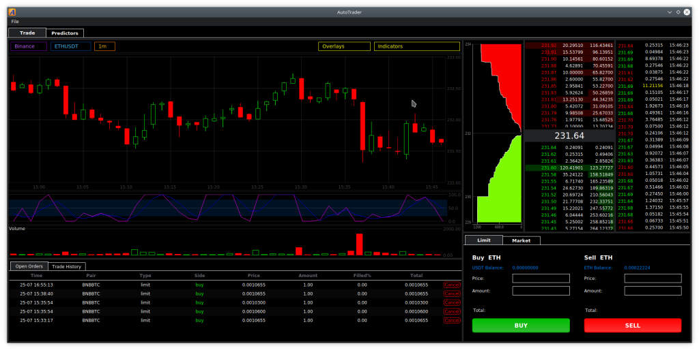

# CryptoTrader: Qt5 GUI for crypto trading

CryptoTrader is a graphical user interface for trading cryptocurrencies 
on multiple crypto exchanges. Currently, Binance and Bitfinex are supported, 
but additional exchanges can be supported easily by extending the exchange 
client abstract classes. CryptoTrader graphical interface is based on Qt5:



## Features

- Candle chart with Zoom In/Out capability
- More than 20 indicators
- Graphical and textual order book view
- Recent trades list view
- User trading control (placing market and limit trades)
- Open orders list
- Recent user trades list
- Ability to quickly switch between exchanges

## How to use

The easiest way to use CryptoTrader at the moment is to build and run the Docker image.

The docker image can be built using the command

```python
$ docker build -t autotrader:latest .
```
and run using

```python
$ git clone https://github.com/mherkazandjian/autotrader.git
$ cd autotrader
$ docker run -it --rm \
        -e DISPLAY=$DISPLAY \
        -v $PWD:/home/developer/autotrader \
        -v /tmp/.X11-unix:/tmp/.X11-unix \
        -v $HOME/.Xauthority:/home/developer/.Xauthority \
        --net=host autotrader
```

